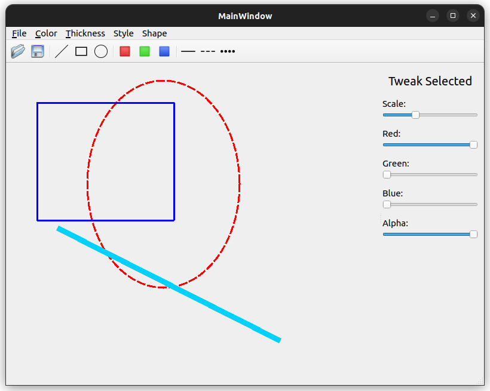

# Paint4D

Author: Barthélemy Paléologue

Paint4D is the result of the Qt TP at Telecom Paris.

## Features

### Shapes

Paint4D support three different shapes : ellipses, rectangles and lines. You can add or remove them (using delete).

### Edition

Paint4D enables the user to select one or multiple shapes (by using shift + click) and edit them separately or all at once. Selected shapes have a rectangular line around their bounding box.

The shapes can be moved by dragging with the mouse, if more than one is selected, they will all move accordingly. You can also use the mouse wheel to scale the selected shapes.

You can edit the color and the scaling of the shapes using the side control panel.

You can also edit the style of the stroke and the tickness.

### Saving & Opening files

Paint4D allows you to save your work in a text file and then load it back when you want. Loading back does not clear the current canvas so it can be used for larger compositions.

### Preventing accidental quits

Paint4D will always ask you before leaving so you never leave the app by accident.
